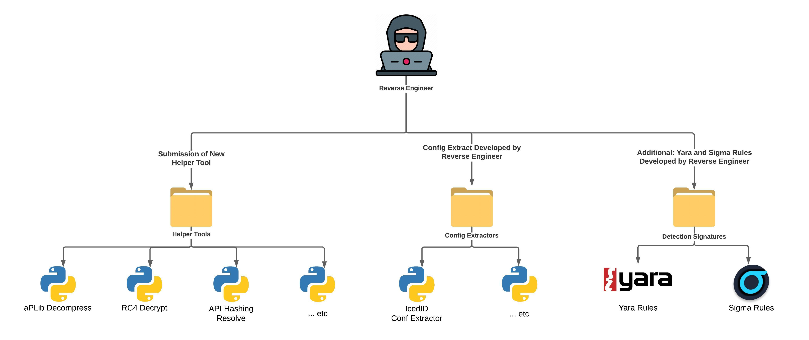
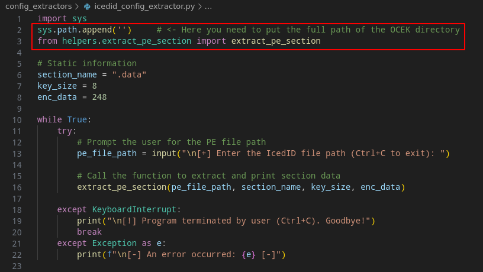

# Open Source Config Extractor Kit [OCEK]

The ***Open Source Config Extractor Kit*** is a tool that helps reverse engineers develop their ***Config Extractors***, without the need to rewrite the same *Helper Tools* code for each *extractor* created.

  

Our project allow the reverse engineer to reuse various *helper tools* implementations in an organized manner, created by us or sent by the community (or created by you, in your own *fork*), to be used in the development of config extractors. Thus, in addition to the code being clean, the reverse engineer will be able to focus on what is most important, the code for extracting intelligence from a given malware.

In addition to all the code, this repository will also contain some *Yara/Siem/Suricata rules*, which we developed during our personal analyses, outside of work (:

Below we can see how you can use the *helper tools*, without the need to rewrite the same code of a function that we can use in a lot of *config extractors*. We can simply write the code once, upload this code into the OCEK's *helpers* directory, and import our helper function into the *extractor's* code.

  

We divide our repo into four directories:

- **APIs**: contain python scripts that interacts with APIs (like *HashDB*); 
- **classes**: contain the custom python classes, used into other other codes;
- **config_extractors**: contain the config extractors code;
- **helpers**: contain the python scripts, that we can reuse into every config extractors, to do some important actions like *decrypting RC4 payload*, *decompress aPLib stagers*, *manipulate hex data* and etc.
- **yara_rules**: contain yara rules, devoloped through our personal malware research.
- **siem_rules**: contain siem rules, devoloped through our personal malware research.
- **suricata_rules**: contain suricata rules, devoloped through our personal malware research.